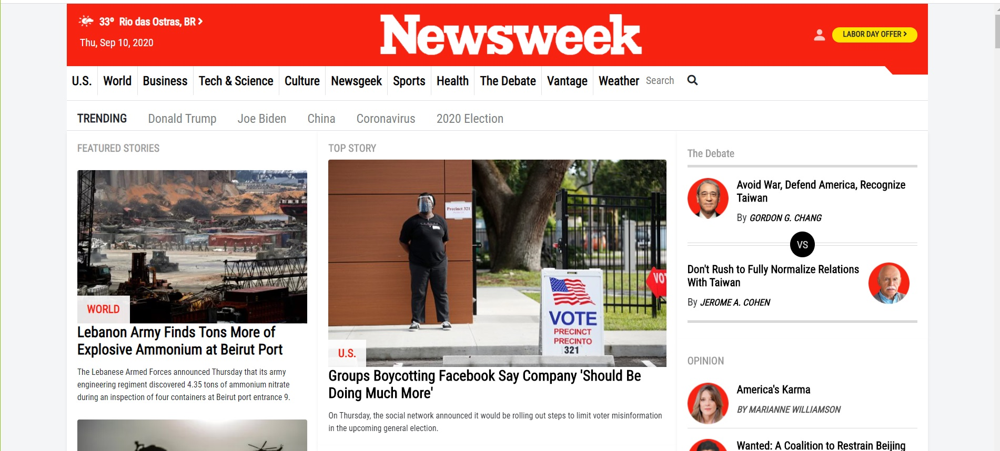

# Newsweek Clone

> Made responsive via bootstrap

## Built With

- HTML
- CSS
- Bootstrap
- Javascript

## Live Demo

[Live Demo Link](https://raw.githack.com/jonathastavares/Newsweek-clone/newsweek-homepage/index.html)

## Authors

👤 **Jonathas Tavares**

- Github: [@githubhandle](https://github.com/jonathastavares)
- Twitter: [@twitterhandle](https://twitter.com/jhstavares)
- Linkedin: [linkedin](https://www.linkedin.com/in/jonathas-tavares-24b8bba3/)

👤 **Martin Najjar**

- Github: [@githubhandle](https://github.com/martinnajjar12)
- Twitter: [@twitterhandle](https://twitter.com/martin_najjar)
- Linkedin: [linkedin](https://www.linkedin.com/in/martin-najjar-174948198/)

## 🤝 Contributing

Contributions, issues and feature requests are welcome!

Feel free to check the [issues page](https://github.com/jonathastavares/Newsweek-clone/issues).

## Show your support

Give a ⭐️ if you like this project!

## Acknowledgments

- [Cloning Newsweek homepage using Bootstrap](https://www.newsweek.com/)

## 📝 License

This project is [MIT](lic.url) licensed.
